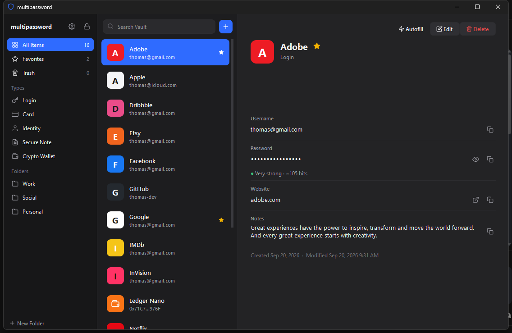
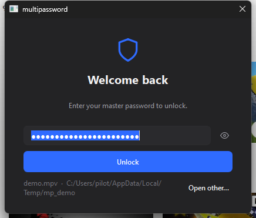
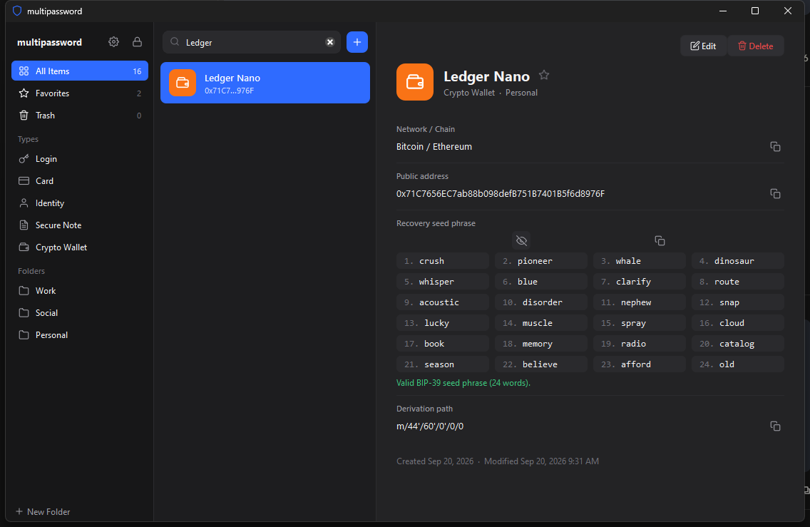
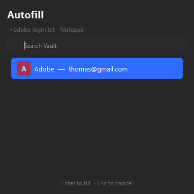
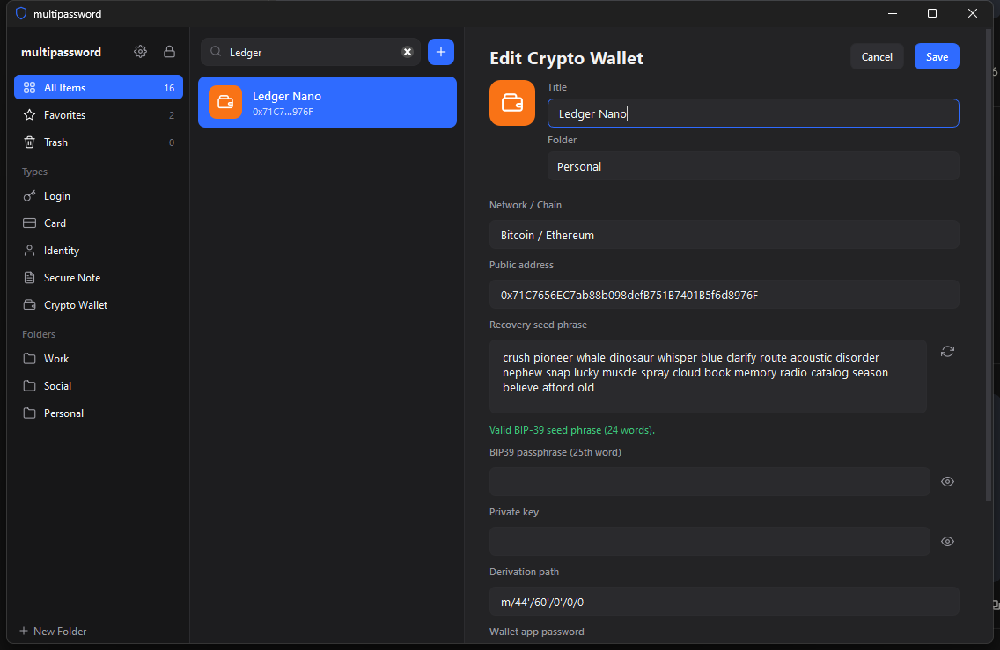
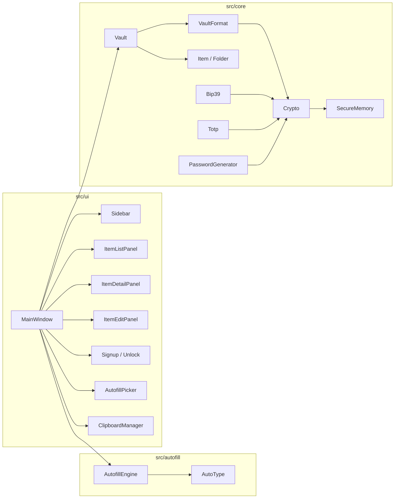

# multipassword

<p align="center">
  
  
  
  
  
  
</p>

<p align="center">
  <a href="#about">About</a> •
  <a href="#features">Features</a> •
  <a href="#screenshots">Screenshots</a> •
  <a href="#building">Building</a> •
  <a href="#autofill">Autofill</a> •
  <a href="#vault-format">Vault format</a> •
  <a href="#structure">Structure</a>
</p>

<p align="center">
  
</p>

## About

multipassword is a password manager written in C++ with Qt 6. Everything is stored in a single encrypted vault file on your machine. There is no account, no server and no sync. It handles normal logins, cards, identities and notes, and it also stores crypto wallet seed phrases, which are checked against the BIP-39 wordlist so a typo can't be saved by accident.

Encryption is done with libsodium: the master password goes through Argon2id and the result unwraps a random vault key that encrypts the data with XChaCha20-Poly1305. Keys and secrets are kept in locked memory and wiped when the vault locks.

## Features

| Area | What it does |
| --- | --- |
| Encryption | Argon2id (256 MiB, parameters stored in the file) → XChaCha20-Poly1305. Changing the master password only rewraps the vault key. |
| Memory | Secrets live in `sodium_malloc` memory (guard pages, `mlock`) and are zeroed on release. Crash dumps are off. |
| Item types | Login, Card, Identity, Secure Note, Crypto Wallet. Favourites, folders, trash. |
| Crypto wallets | Seed phrase with BIP-39 checksum validation, 12/24-word generation, passphrase, private key, address, derivation path. |
| Autofill | Global hotkey (`Ctrl+Alt+A`). Reads the focused window title and browser URL, matches by host, types the credentials. Sequence is configurable. |
| TOTP | RFC 6238 codes with countdown. |
| Generator | Random passwords and diceware passphrases, both from the OS CSPRNG. |
| Clipboard | Copied secrets clear after 30 s and are excluded from Windows clipboard history. |
| Locking | Auto-lock on idle, minimize, screen lock and sleep. Wrong-password lockout. Optional exclusion from screenshots / screen share. |
| Saving | Temp file → flush → `ReplaceFile`, previous vault kept as `.bak`. Encrypted backup export. |
| Onboarding | Sign-up page with strength meter, requirement checklist, confirmation and optional hint. |

## Screenshots

<table>
  <tr>
    <td align="center"><br><sub>Unlock</sub></td>
    <td align="center"><br><sub>Crypto wallet, seed phrase revealed</sub></td>
  </tr>
  <tr>
    <td align="center"><br><sub>Autofill picker</sub></td>
    <td align="center"><br><sub>Editing a wallet</sub></td>
  </tr>
</table>

Screenshots use data from `mp_seed_demo`. The seed phrase in them is random.

## Building

Windows only for now (the autofill layer is Win32). Tested with Visual Studio 2026 / MSVC 14.51, Qt 6.9.3 and the vcpkg build of libsodium.

```powershell
C:\vcpkg\vcpkg install libsodium:x64-windows
$env:QT_DIR = "C:\Qt\6.9.3\msvc2022_64"
.\build.ps1 release
```

Output goes to `build\windows-release\`. `windeployqt` runs as a post-build step so the folder is runnable as is.

```text
.\build.ps1 release     build
.\build.ps1 debug       debug build
.\build.ps1 test        build and run mp_tests
.\build.ps1 clean       remove build/
```

`build.ps1` sets up the MSVC environment itself, so it works from a plain PowerShell window. If you prefer CMake directly, `CMakePresets.json` has `windows-release` / `windows-debug` presets that read `VCPKG_ROOT` and `QT_DIR` from the environment.

To try the UI with sample data:

```powershell
.\build\windows-release\mp_seed_demo.exe demo.mpv "correct horse battery staple"
.\build\windows-release\multipassword.exe --vault demo.mpv
```

## Tests

`mp_tests` covers the core: AEAD tamper detection, KDF, vault container round-trip and corruption, create/open/save/change-password, BIP-39 checksums, RFC 6238 vectors, the generator and autofill matching.

```text
112 checks, 0 failures, 0/10 tests failed
```

## Autofill

1. Focus the login form in any application or browser.
2. Press `Ctrl+Alt+A`.
3. One exact URL match is typed straight away. Otherwise a picker shows the matches; Enter fills the selected one.

Sequences can use `{USERNAME}`, `{PASSWORD}`, `{TAB}`, `{ENTER}`, `{SPACE}`, `{DELAY 500}` and any field key such as `{totp}`. Typing stops immediately if another window takes focus.

Known issue: in the Windows 11 Notepad app two characters were substituted during testing. Browsers and normal edit controls are the intended targets; if you hit this elsewhere, open an issue.

## Vault format

```text
offset  size   field
0       4      magic "MPV\x01"
4       1      format version
5       1      KDF id (1 = Argon2id v1.3)
6       8      Argon2 opsLimit
14      8      Argon2 memLimit (bytes)
22      16     salt
38      1      flags
39      72     wrapped vault key   XChaCha20-Poly1305(masterKey, vaultKey), AAD = bytes[0,39)
111     ...    body                XChaCha20-Poly1305(vaultKey, JSON),      AAD = bytes[0,111)
```

The master key is never written to disk and is dropped right after the vault key is unwrapped. Every save uses a fresh 192-bit nonce. KDF parameters are bounded on parse so a crafted file can't exhaust memory. More detail in [SECURITY.md](SECURITY.md).

## Architecture



## Structure

```text
multipassword/
├── src/
│   ├── core/          SecureMemory, Crypto, VaultFormat, Vault, Item, Bip39, Totp, PasswordGenerator, Settings
│   ├── autofill/      AutofillEngine, AutoType
│   ├── ui/            MainWindow, Sidebar, ItemListPanel, ItemDetailPanel, ItemEditPanel, dialogs
│   └── main.cpp
├── resources/         BIP-39 wordlist, Windows manifest
├── tests/             test_main.cpp, seed_demo_vault.cpp
├── docs/              screenshots
├── CMakeLists.txt
├── CMakePresets.json
├── build.ps1
└── vcpkg.json
```

## Shortcuts

```text
Ctrl+N        new login
Ctrl+E        edit selected item
Ctrl+S        save (while editing)
Ctrl+F        search
Ctrl+L        lock
Ctrl+,        settings
Ctrl+Alt+A    autofill (global)
```

## Build

```text
Language     C++20
UI           Qt 6 Widgets
Crypto       libsodium 1.0.22
Platform     Windows x64
License      MIT
```

## Releases

CI builds and tests every push. Pushing a `v*` tag attaches `multipassword-windows-x64.zip` to a GitHub release.

<p align="center">
  <a href="https://github.com/pilottX11/multipassword">
    
  </a>
</p>

<p align="center">
  <sub>encrypted password and seed phrase manager</sub>
</p>
