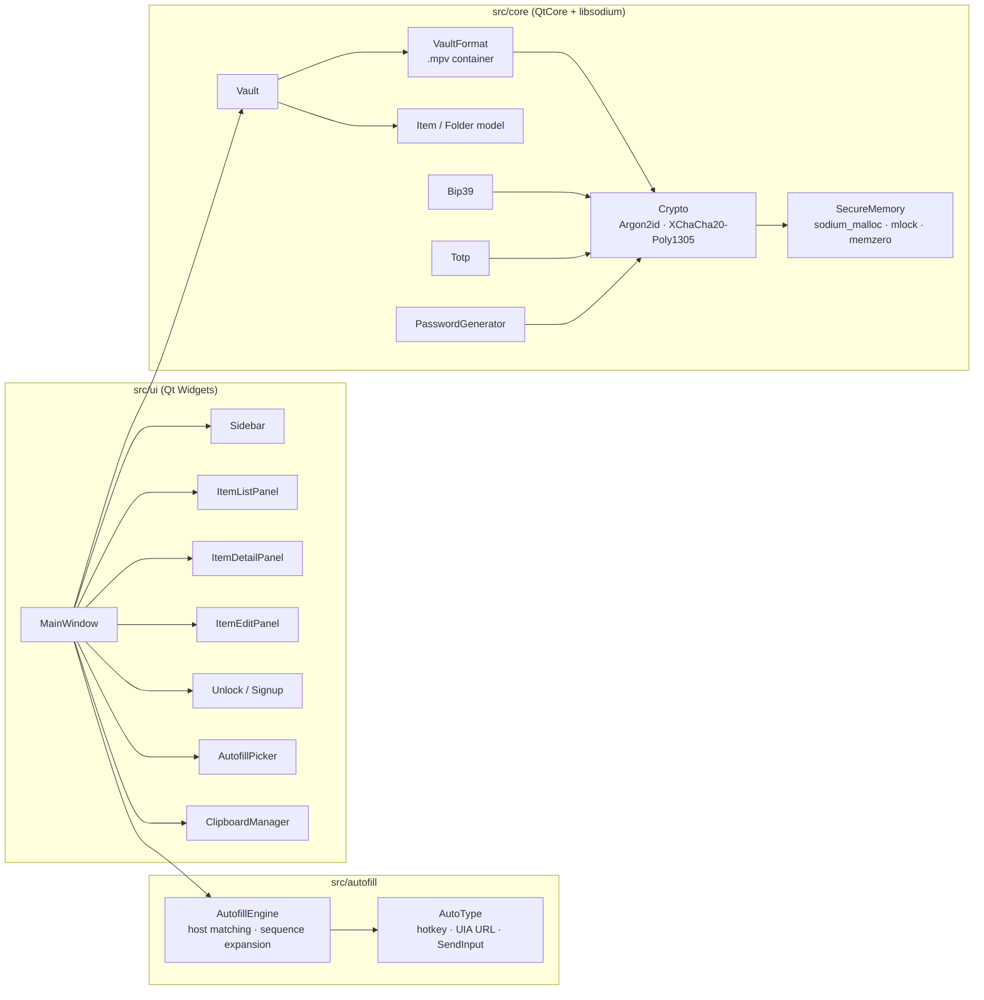

<div align="center">


# 🛡️ multipassword

**A local-first, end-to-end encrypted password manager for logins, cards, identities, secure notes and crypto wallet seed phrases — written in modern C++ with Qt 6 and libsodium.**

[](https://isocpp.org/)
[](https://www.qt.io/)
[](https://libsodium.org/)
[](https://en.wikipedia.org/wiki/Argon2)
[](https://libsodium.gitbook.io/doc/secret-key_cryptography/aead/chacha20-poly1305/xchacha20-poly1305_construction)
[](https://github.com/bitcoin/bips/blob/master/bip-0039.mediawiki)
[](#building)
[](https://github.com/pilottX11/multipassword/actions/workflows/build.yml)
[](#tests)
[](LICENSE)

</div>

---

## ✨ Features

| | Feature | Details |
|:-:|---|---|
| 🔐 | **Strong encryption** | Argon2id (256 MiB, tunable) → XChaCha20-Poly1305 AEAD. Two-level keying: a random vault key is wrapped by your master key, so changing the master password never re-encrypts your data. |
| 🧠 | **Locked memory** | Every key, password and seed phrase lives in `sodium_malloc` guard-paged, `mlock`ed memory and is wiped on release. |
| 🪙 | **Crypto wallets** | Seed phrases are validated against the BIP-39 wordlist **with checksum**, shown as a numbered word grid, and can be generated (12/24 words) from the OS CSPRNG. Also stores passphrase (25th word), private key, address and derivation path. |
| 🔑 | **Logins, cards, identities, notes** | Typed records with the fields you expect, favourites, folders and trash. |
| ⚡ | **Autofill** | System-wide hotkey (`Ctrl+Alt+A`). Detects the focused window and browser URL (UI Automation), matches by host, and auto-types `{USERNAME}{TAB}{PASSWORD}{ENTER}` — the sequence is configurable. |
| 🔢 | **TOTP** | Built-in RFC 6238 one-time codes with live countdown. |
| 🎲 | **Generator** | Passwords (no modulo bias, guaranteed character classes) and diceware passphrases (11 bits/word). |
| 📋 | **Clipboard hygiene** | Copied secrets auto-clear after 30 s and are excluded from Windows clipboard history / cloud sync. |
| ⏱️ | **Auto-lock** | On inactivity, minimise, screen lock or sleep. Exponential lockout on wrong passwords. |
| 🖥️ | **Screen-capture shield** | Optional `WDA_EXCLUDEFROMCAPTURE` so the window is invisible to screenshots and screen sharing. |
| 💾 | **Atomic saves** | Temp file → `fsync` → `ReplaceFile`, with a `.bak` of the previous vault. Encrypted backup export. |
| 🎨 | **Faithful UI** | Three-pane dark interface recreated one-to-one from the reference design. |
| 🧾 | **Sign-up page** | First-run onboarding: name, master password with live strength meter + requirement checklist, confirmation, optional hint, and an explicit "cannot be recovered" acknowledgement before the vault is created. |

---

## 📸 Screenshots

<table>
  <tr>
    <td align="center"><br><sub>Unlock</sub></td>
    <td align="center"><br><sub>Crypto wallet — seed phrase revealed &amp; checksum-verified</sub></td>
  </tr>
  <tr>
    <td align="center"><br><sub>Autofill picker (Ctrl+Alt+A)</sub></td>
    <td align="center"><br><sub>Editing a wallet with live BIP-39 validation</sub></td>
  </tr>
</table>

> Screenshots use generated demo data (`mp_seed_demo`). The seed phrase shown is random and controls nothing.

---

## 🏗️ Architecture



### Vault file format (`.mpv`)

```
offset  size   field
0       4      magic "MPV\x01"
4       1      format version
5       1      KDF id (1 = Argon2id v1.3)
6       8      Argon2 opsLimit          ┐ stored per file, so parameters
14      8      Argon2 memLimit (bytes)  ┘ can be raised without migration
22      16     salt
38      1      flags
39      72     wrapped vault key  = XChaCha20-Poly1305(masterKey, vaultKey)   AAD = bytes[0,39)
111     …      body               = XChaCha20-Poly1305(vaultKey, JSON)       AAD = bytes[0,111)
```

* `masterKey = Argon2id(masterPassword, salt)` — never stored, never retained after unlock.
* Every save uses a fresh 192-bit random nonce; tampering with any byte of header or body fails authentication.
* Crafted files cannot DoS the machine: KDF parameters are bounded on parse.

More in [SECURITY.md](SECURITY.md).

---

## 🚀 Building

### Prerequisites (Windows)

| Tool | Tested with |
|---|---|
| Visual Studio 2022/2026 with *Desktop development with C++* | MSVC 14.51 |
| Qt 6 (MSVC 2022 x64 kit) | 6.9.3 |
| vcpkg with `libsodium` | 2026-07 |
| CMake ≥ 3.21 + Ninja | bundled with VS |

```powershell
# 1. dependencies
C:\vcpkg\vcpkg install libsodium:x64-windows

# 2. build (auto-detects MSVC / Windows SDK, uses CMakePresets.json)
$env:QT_DIR = "C:\Qt\6.9.3\msvc2022_64"      # adjust to your kit
.\build.ps1 release                            # → build\windows-release\multipassword.exe (Qt DLLs deployed)

# 3. run
.\build\windows-release\multipassword.exe
```

Other tasks: `.\build.ps1 debug`, `.\build.ps1 test`, `.\build.ps1 clean`.

<details>
<summary>Manual CMake invocation</summary>

```powershell
cmake --preset windows-release
cmake --build --preset windows-release
ctest --preset windows-release
```

`CMakePresets.json` reads `VCPKG_ROOT` and `QT_DIR` from the environment.
</details>

---

## 🧪 Tests

`mp_tests` is a dependency-free runner covering the security-critical core:

```
[  OK  ] secure_bytes_basics
[  OK  ] aead_roundtrip_and_tamper       # wrong key / wrong AAD / flipped bit all rejected
[  OK  ] kdf_deterministic
[  OK  ] vault_format_roundtrip          # header tamper, bad magic
[  OK  ] vault_create_open_save          # atomic save, .bak, wrong password, change master password, corrupt file
[  OK  ] bip39_validation                # checksum, unknown words, 12/15/18/21/24-word generation
[  OK  ] totp_rfc6238_vectors            # RFC 6238 Appendix B test vectors
[  OK  ] password_generator
[  OK  ] autofill_matching               # host-suffix rules, sequence expansion
[  OK  ] item_json_roundtrip

112 checks, 0 failures, 0/10 tests failed
```

```powershell
.\build.ps1 test
```

To explore the UI with sample data:

```powershell
.\build\windows-release\mp_seed_demo.exe demo.mpv "correct horse battery staple"
.\build\windows-release\multipassword.exe --vault demo.mpv
```

---

## ⚡ Autofill

1. Focus the login form in any app or browser.
2. Press **Ctrl + Alt + A** (configurable in *Settings*).
3. If exactly one entry matches the page URL it is typed immediately; otherwise a picker lists the best matches.

Type sequences support `{USERNAME}`, `{PASSWORD}`, `{TAB}`, `{ENTER}`, `{SPACE}`, `{DELAY 500}` and any field key such as `{totp}` or `{cardholder}`. Typing aborts instantly if focus moves to another window, so a secret is never typed into the wrong place.

> **Known quirk:** in the Windows 11 *Notepad* app two characters were substituted during an auto-type test; classic edit controls and browsers are the intended targets — please verify on your login pages and report anything odd.

---

## ⌨️ Shortcuts

| Keys | Action |
|---|---|
| `Ctrl+N` | New login |
| `Ctrl+E` | Edit selected item |
| `Ctrl+S` | Save (while editing) |
| `Ctrl+F` | Search |
| `Ctrl+L` | Lock vault |
| `Ctrl+,` | Settings |
| `Ctrl+Alt+A` | Autofill (global) |

---

## 📁 Project layout

```
multipassword/
├── CMakeLists.txt · CMakePresets.json · vcpkg.json · build.ps1
├── src/
│   ├── core/       SecureMemory · Crypto · VaultFormat · Vault · Item · Bip39 · Totp · PasswordGenerator · Settings
│   ├── autofill/   AutofillEngine · AutoType (Win32)
│   ├── ui/         MainWindow · Sidebar · ItemListPanel · ItemDetailPanel · ItemEditPanel · Signup/Unlock · dialogs
│   └── main.cpp
├── resources/      BIP-39 wordlist · icons · Windows manifest
├── tests/          test_main.cpp · seed_demo_vault.cpp
└── docs/           screenshots
```

---

## 🔒 Security model in one paragraph

Your master password never leaves the process and is never written anywhere. It is stretched with Argon2id into a key that only unwraps a random 256-bit vault key; that key decrypts the vault body. All key material sits in locked, guard-paged memory and is wiped when the vault locks. The window can be hidden from screen capture, the clipboard self-cleans, DLL search paths are hardened and crash dumps are disabled so plaintext never reaches disk. What this *cannot* protect against: malware running with your privileges while the vault is unlocked, or a weak master password — pick a long passphrase.

---

<div align="center">
<sub>Built with C++20 · Qt 6 · libsodium — icons from <a href="https://feathericons.com">Feather</a> (MIT)</sub>
</div>

## 🤝 Contributing

See [CONTRIBUTING.md](CONTRIBUTING.md). Security issues go through GitHub's private vulnerability reporting — see [SECURITY.md](SECURITY.md).

## 📦 Releases

Every push to `main` builds and tests on GitHub Actions; pushing a tag like `v1.0.0` publishes a ready-to-run `multipassword-windows-x64.zip` on the Releases page.
